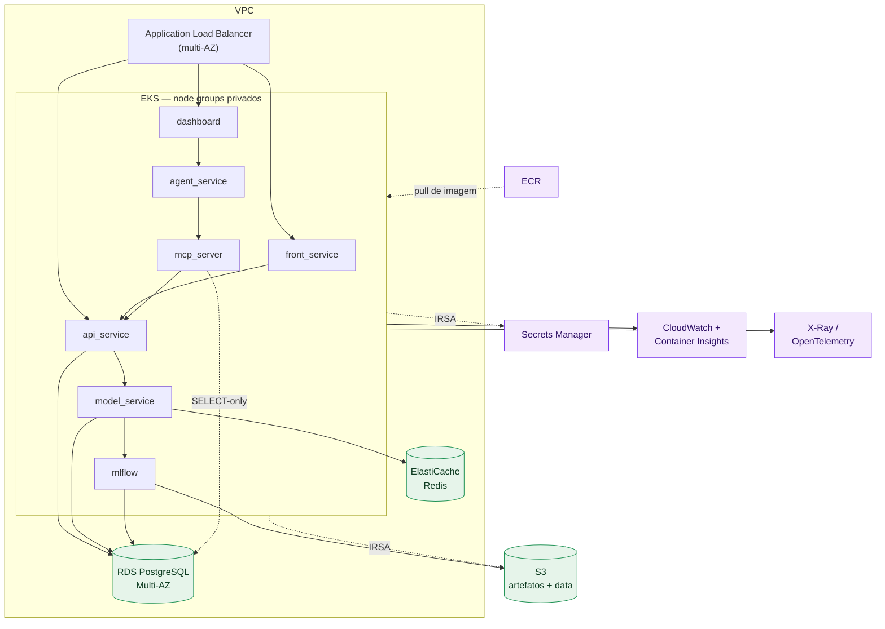

# Recursos de nuvem (produção)

A arquitetura de hoje ([Visão geral do sistema](system-overview.md)) roda
inteira em containers stateless mais Postgres/Redis/MLflow single-instance,
via Docker Compose ou um Helmfile que só cobre metade do sistema. Esta página
mapeia cada componente para um recurso gerenciado AWS — o alvo de produção —
e é explícita sobre o que falta hoje para chegar lá, em vez de só descrever o
destino.

## Mapa componente → recurso

| Componente hoje | Recurso AWS alvo | Por quê |
| --- | --- | --- |
| `api_service`, `model_service`, `agent_service`, `mcp_server`, `dashboard`, `front_service` (containers stateless) | **EKS**, um Deployment + HPA por serviço | Escala cada serviço pela própria carga; hoje é 1 réplica fixa em todo lugar |
| Acesso externo aos serviços | **Application Load Balancer** (AWS Load Balancer Controller / Ingress) | Health checks e múltiplas AZs na frente do tráfego, não uma única instância |
| Postgres `postgres` + `model_service` (mesma instância `postgres:16`) | **RDS for PostgreSQL, Multi-AZ** | Falha automática; hoje é uma instância única no volume `postgres_data` |
| Redis (estado do bandit) | **ElastiCache for Redis**, com réplicas | Hoje é `redis:7-alpine` single-instance — perder o container perde o estado aprendido |
| MLflow (tracking + registry) | Servidor MLflow no EKS, backend store em **RDS Postgres**, artefatos em **S3** | Ver nota abaixo — o backend store de hoje não sobrevive a isso |
| `./data` (golden set, catálogo) e artefatos MLflow | **S3**, versionado e criptografado | Hoje presos em volumes locais, acoplados ao ciclo de vida dos containers |
| `.env` / exemplos de Secret do Kubernetes | **AWS Secrets Manager** (ou Parameter Store) | Hoje são arquivo texto/exemplo versionado — sem rotação, sem IAM por serviço |
| Nenhum hoje | **ECR** por serviço + pipeline de deploy | Hoje não existe *nenhum* jeito automatizado de publicar uma imagem em produção |
| Datadog opcional (`api_service`/`model_service` só) | **CloudWatch** + **Container Insights** + **X-Ray**/OpenTelemetry | Cobrir os serviços que hoje não emitem log/trace nenhum (`agent_service`, `mcp_server`, frontends) |

## Compute: EKS + ALB

Cada serviço stateless vira um Deployment com HPA reagindo à própria carga —
`api_service` e `model_service` sob mais carga de decisão em rajada que
`mcp_server`, por exemplo, não precisam escalar juntos. O ALB fica na frente
de tudo, com health checks por serviço e node groups em múltiplas AZs, para
que a falha de uma zona não tire o sistema do ar.

## Postgres e Redis: RDS Multi-AZ e ElastiCache

Uma instância RDS Multi-AZ substitui o `postgres:16` de hoje — as duas
databases lógicas (`postgres` para `api_service`, `model_service` para
governança) continuam separadas por database, exatamente como hoje, já que
essa separação existe por causa de cadeias Alembic e ciclos de deploy
independentes, não por causa de infraestrutura. Vale considerar **duas
instâncias RDS** em vez de uma só, dado que os dois serviços já são
deployáveis independentemente — isso evita que uma migração/carga pesada de
um serviço degrade o outro.

ElastiCache substitui o Redis single-instance que guarda
`bandit:state:{policy_id}` — é o único lugar onde o peso aprendido do bandit
vive (ver [Modelo de domínio](../domain-model.md)), então perder essa
instância sem réplica é perder o aprendizado de todas as políticas ativas.

## MLflow: o backend store de hoje não migra como está

O `mlflow` do compose roda com
`--backend-store-uri sqlite:////mlruns/mlflow.db` — um arquivo SQLite num
volume Docker. Isso funciona para um container único, mas não tem
concorrência segura de escrita nem alta disponibilidade: **não é só trocar o
container de lugar**, o backend store precisa mudar. Alvo: MLflow rodando no
EKS apontando `--backend-store-uri` para o Postgres do RDS (uma terceira
database lógica, ou a mesma instância do `model_service` já que quem fala com
MLflow é justamente esse serviço) e `--default-artifact-root s3://...` para
artefatos, desacoplando o registry do disco do container.

## OpenSearch e Neo4j: não provisionar

O Helmfile atual (`infra/k8s/`) já sobe OpenSearch, OpenSearch Dashboards e
Neo4j — mas **nenhum serviço da aplicação consome nenhum dos dois** (ver
[Visão geral do sistema](system-overview.md#topologia-de-implantacao) e a
nota equivalente em [Infraestrutura](../infra.md)); são resquício de um
desenho anterior com RAG/grafo que não foi adiante. A recomendação para
produção é a mesma que vale para o cluster de dev: **não provisionar** Amazon
OpenSearch Service nem Neo4j Aura até existir um consumidor real no código —
manter esses recursos "porque o Helm chart já provisiona" só herda um custo
de infraestrutura sem função.

## Secrets: de arquivo texto para Secrets Manager

Hoje `SECRET_KEY`, as senhas de Postgres/Redis, `OPENAI_API_KEY`,
`DOWNSTREAM_API_TOKEN` e `READONLY_DB_PASSWORD` (a role somente-leitura do
assistente de texto-para-SQL, ver [mcp_server](../services/mcp-server.md)) vivem em
`.env` (compose) ou em exemplos de manifesto `Secret` versionados em
`infra/k8s/secrets/*.example` (os reais, gitignored). Em produção isso vira
**AWS Secrets Manager**, injetado nos pods via **IRSA** (IAM Roles for
Service Accounts) + External Secrets Operator (ou o CSI Secrets Store
Driver) — cada serviço lê só os segredos que precisa, com rotação possível
sem redeploy de imagem.

## O maior buraco: não existe pipeline de deploy

`.github/workflows/` hoje tem dois workflows: `ci.yml` (testes) e `docs.yml`
(build + publish do MkDocs no GitHub Pages). **Nenhum dos dois publica uma
imagem de container em lugar nenhum**, e o chart Helm do `api_service` usa
`pullPolicy: Never` — ou seja, hoje a única forma de "implantar" é buildar a
imagem manualmente dentro do cluster local (`minikube`/`kind`). Isso é o
maior gap real entre o estado atual e "pronto para produção": antes de EKS
fazer sentido, precisa existir **ECR** (um repositório por serviço) e um
workflow de deploy — gated pelos testes que `ci.yml` já roda — que builda,
taggeia por commit e publica a imagem, e então aplica o Helmfile/manifests
contra o cluster alvo.

## Rede e IAM

VPC com subnets privadas para os node groups do EKS, RDS e ElastiCache, e
subnets públicas só para o ALB. Security groups restringem o acesso a
Postgres/Redis ao security group dos nós do EKS — nada de exposição direta à
internet, ao contrário do `ports: 5432:5432` / `6379:6379` do compose local.
Acesso dos pods a S3/Secrets Manager via **IRSA**, não credenciais estáticas
em variável de ambiente.

## Observabilidade

Hoje só `api_service` e `model_service` emitem log estruturado em JSON e
traces via `ddtrace`, coletados por um agente Datadog opcional
(`--profile datadog`, ver [Observabilidade](../observability-datadog.md));
`agent_service`, `mcp_server` e os frontends ainda logam isoladamente, sem
coleta centralizada. Em nuvem, **CloudWatch** centraliza logs/métricas de
todos os pods do EKS, **Container Insights** dá visibilidade de
cluster/pod, e tracing distribuído (**X-Ray** ou OpenTelemetry) acompanha
uma requisição pelos quatro serviços do fluxo admin (dashboard →
agent_service → mcp_server → api_service) sem precisar correlacionar logs à
mão — mas isso só fecha a lacuna se `agent_service`, `mcp_server` e os
frontends ganharem a mesma instrumentação que `api_service`/`model_service`
já têm hoje. Alarmes ligados a SLOs de latência, taxa de erro e saturação —
não só uptime — fecham o ciclo, detectando degradação antes de virar
indisponibilidade.

## Topologia alvo

## Resumo: o que falta hoje

Nenhum destes recursos existe no repositório hoje — nem Terraform/CDK, nem
workflow de deploy, nem menção fora desta página e de `README.md`/
`docs/index.md`. Em ordem de bloqueio:

1. **Pipeline de imagem/deploy** (ECR + workflow) — sem isso nada mais nesta
   página é alcançável, é puramente manual hoje.
2. **Secrets Manager** — pré-requisito para rodar com credenciais reais fora
   de `.env`.
3. **RDS/ElastiCache/S3** — migração dos dados stateful, incluindo o
   backend store do MLflow, que precisa mudar de SQLite antes de mover de
   lugar.
4. **EKS + ALB + HPA** — o compute em si, uma vez que os três itens acima
   existem.
5. **CloudWatch/X-Ray + instrumentação em `agent_service`/`mcp_server`/
   frontends** — fecha a lacuna de observabilidade que já existe mesmo hoje,
   local.
