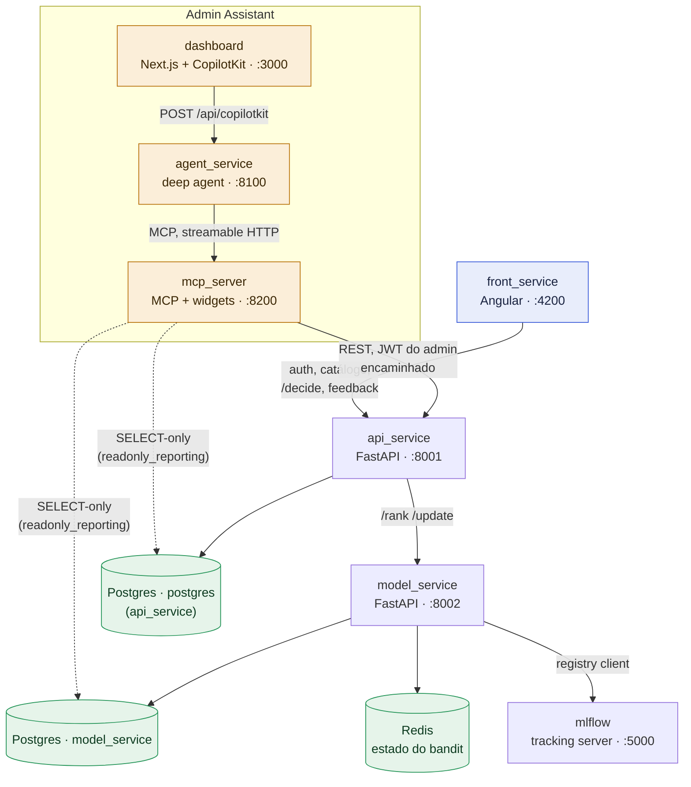

# Visão geral do sistema

A plataforma **HP Invest** tem três frentes que rodam como serviços
independentes, cada uma com seu próprio ciclo de deploy: a **vitrine do
cliente** (`front_service` → `api_service`), o **motor de recomendação**
(`api_service` ↔ `model_service`, o multi-armed bandit contextual), e o
**assistente administrativo** (`dashboard` → `agent_service` → `mcp_server`,
detalhado em [Admin Assistant](admin-assistant.md)). Esta página mostra como
essas três frentes se encaixam — para o desenho de cada tabela, ver
[Modelo de domínio](../domain-model.md); para como cada peça é implantada
hoje e como implantaria em nuvem, ver [Infraestrutura](../infra.md) e
[Recursos de nuvem](cloud-resources.md).

## Componentes

| Serviço | Stack | Porta (compose) | Responsabilidade |
| --- | --- | --- | --- |
| `front_service` | Angular | 4200 | Vitrine do cliente: cadastro, recomendação ao vivo, interação |
| `api_service` | FastAPI + Postgres (`postgres`) | 8001 | Auth, catálogo, `/decide`, log de decisões/eventos/recompensas, dados admin |
| `model_service` | FastAPI + Postgres (`model_service`) + Redis | 8002 | `/rank` `/update` do bandit, governança de políticas, registry MLflow |
| `mlflow` | MLflow tracking server | 5000 | Registro de modelos/experimentos (hoje: backend store SQLite) |
| `apps/dashboard` | Next.js + CopilotKit | 3000 | UI do assistente administrativo |
| `agent_service` | Python, deepagents + AG-UI | 8100 | Deep agent (OpenAI) que orquestra as tools do MCP |
| `mcp_server` | Node/TypeScript, MCP + mcp-ui | 8200 | Expõe tools/widgets `mcpApp`, incl. schema e SQL somente-leitura |
| PostgreSQL | `postgres:16` | 5432 | Duas databases lógicas: `postgres` (api_service) e `model_service` |
| Redis | `redis:7-alpine` | 6379 | Estado aprendido do bandit (`bandit:state:{policy_id}`) |

## Como as peças se conectam

Setas cheias são chamadas de rede reais (REST/MCP) ou o cliente de banco de
cada serviço; a seta pontilhada é o acesso somente-leitura que o
`mcp_server` tem às duas databases para o assistente responder perguntas em
linguagem natural sobre os dados — ver
[`run_sql_query`/`get_db_schema`](../services/mcp-server.md) e a role `readonly_reporting`
em `infra/docker/initdb/02-readonly-role.sh`.

Dois pontos que já aparecem em [Modelo de domínio](../domain-model.md) vale
repetir aqui porque moldam a topologia: **`api_service` e `model_service` têm
bancos Postgres separados de propósito** (cadeias Alembic independentes,
ciclos de deploy independentes), então a referência de `decisoes.policy_version`
para uma política em `model_service` é uma string solta, não uma FK — não há
FK possível entre databases diferentes. E o **estado aprendido do bandit não
mora em nenhum Postgres**: vive no Redis, chaveado por `policy_id`, para que
trocar de política (shadow/rollback) recupere um conjunto de pesos intacto
sem duplicar o mesmo estado em dois lugares.

## Topologia de implantação

Hoje há dois alvos de implantação, e eles cobrem partes diferentes do
sistema — ver a tabela completa em [Infraestrutura](../infra.md).

**Docker Compose** (`docker-compose.yml`) é o único alvo que sobe o sistema
inteiro, via profiles opt-in: `postgres`/`redis`/`pgadmin` sempre ativos;
`--profile api` soma `api`, `model`, `mlflow`; `--profile app` soma
`dashboard`, `agent_service`, `mcp_server`; `--profile datadog` soma o agente
Datadog (APM/logs para `api`/`model`). `front_service` roda junto com
`--profile app`.

**Kubernetes** (`infra/k8s/`, Helm + Helmfile) está incompleto nos dois
sentidos: **sobra** — o Helmfile provisiona OpenSearch, OpenSearch Dashboards
e Neo4j (charts `opensearch-project/opensearch` e `bitnami/neo4j`) que
**nenhum serviço do sistema consome hoje** (resquício de um desenho anterior
com RAG/grafo — mesma ressalva que `.env.example` já registra); e **falta** —
só existe chart próprio (`infra/k8s/charts/api`) para o `api_service`. Não há
chart para `model_service`, `mlflow`, `agent_service`, `mcp_server`,
`dashboard` nem `front_service` — esses continuam existindo apenas via
Compose. Um cluster Kubernetes hoje sobe menos da metade do sistema.

Nenhum dos dois alvos é a arquitetura de produção pretendida — ver
[Recursos de nuvem](cloud-resources.md) para o mapeamento de cada componente
para um serviço gerenciado AWS, incluindo as lacunas que nem Compose nem o
Helmfile atual endereçam (registro de imagens, pipeline de deploy, secrets
gerenciados).
