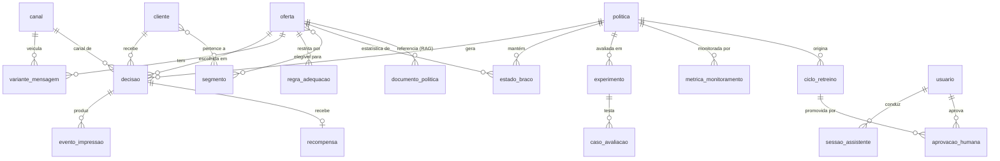

# Modelo de Domínio — HP Invest (Plataforma MAB)

Entidades da plataforma de experimentação adaptativa (multi-armed bandit contextual)
que decide qual **oferta / mensagem / próximo passo** apresentar a cada cliente elegível,
com assistente LLM + RAG, avaliação por golden set e governança (Datathon 7MLET — Grupo 68).

> **Princípio:** só vira tabela o que tem identidade e ciclo de vida próprios.
> Vetores de contexto, elegibilidade, reason codes e versões de catálogo são
> **transientes ou enums** — calculados/serializados, não tabelas.

> ⚠️ **Escopo do backend (atualização):** o **assistente LLM + RAG** será uma **API separada**.
> As entidades `documento_politica` e `sessao_assistente` **não** fazem parte deste backend
> (removidas do código e da migração). `canal` virou **enum** em `decisao` e `variante_mensagem`
> foi descartada — a modelagem seguiu o `offer_catalog.json` real (LinUCB + reward composto).
> O contrato vigente do backend está em `docs/backend-roadmap.md` e `docs/api-contracts.md`.

## Mapa de prioridade

| Bloco | Tabelas | Etapa que exige |
|---|---|---|
| Catálogo & Contexto | `cliente`, `oferta`, `segmento`, `canal`, `variante_mensagem` | 1–2 |
| Decisão & Aprendizado | `decisao`, `evento_impressao`, `recompensa`, `politica`, `estado_braco` | 3, 5 |
| Avaliação & Assistente | `caso_avaliacao`, `experimento`, `documento_politica`, `sessao_assistente` | 4, assistente LLM |
| MLOps & Governança | `metrica_monitoramento`, `regra_adequacao`, `ciclo_retreino`, `aprovacao_humana` | 7–8 |
| Operação | `usuario` (operador + cliente-demo via `tipo`) | 0/5 |
| Demonstração (opc.) | reusa `usuario` + `cliente` — sem tabela nova (ver §6) | Demo Day |

**Persistência:** Postgres para o transacional (`decisao`, `recompensa`, `politica`,
`estado_braco`, `sessao_assistente`, `metrica_monitoramento`, `ciclo_retreino`,
`aprovacao_humana`, `usuario`). Arquivo versionado para o que é dado de referência
(`oferta`/`segmento`/`canal`/`variante_mensagem` → `offer_catalog.json`,
`caso_avaliacao` → JSONL, `documento_politica` → `rag_corpus` + vector store).

**`cliente` é uma camada híbrida** (ver §6):
- **Analítica (CSV, completa):** `data/synthetic_enrichment/clientes_br_sintetico.csv`
  (~1,35 M linhas) e `golden_clients.csv` permanecem em arquivo para treino/avaliação.
- **Serving (Postgres, subset):** um recorte do `golden_clients.csv` é *seedado* na tabela
  `cliente` para dar contexto à demo e habilitar os filtros de elegibilidade em runtime.
  Perfis criados via cadastro da demo também vivem aqui (`origem='demo'`).

---

## 1. Catálogo & Contexto

### `cliente`
**O que é:** o cliente do banco digital, sujeito elegível de cada decisão. Fornece o
**vetor de contexto** (idade, segmento, produtos que já possui) que o bandit usa para escolher a oferta.
Origem: `data/golden_set/golden_clients.csv` (sintético, derivado do Santander). Um subset é
seedado no Postgres e perfis de cadastro da demo são anexados aqui (ver §6).

| Campo | Tipo | Nota |
|---|---|---|
| `cod_cliente` | int (PK) | identificador sintético; perfis `demo` usam faixa reservada (ex.: `≥ 9.000.000`) |
| `idade` | int | atributo de contexto |
| `sexo` | str | **protegido** — só fairness, não é feature de decisão |
| `estado` | str | UF |
| `segmento` | str | `01 ALTA RENDA` / `02 VAREJO` / `03 UNIVERSITARIO` |
| `renda_estimada_anual_brl` | float | **sensível monitorado** — feature de contexto e eixo da elegibilidade (`renda_percentil_min`); fairness por faixa de renda |
| `tempo_relacionamento_meses` | int | contexto |
| `ind_ativo` | bool | contexto |
| `possui_*` (24 flags) | bool | produtos atuais; base da recompensa (transição `0→1`) |
| `segmentos_sinteticos` | list[str] | segmentos derivados |
| `origem` | enum (`seed` / `demo`) | `seed` = veio do dataset; `demo` = criado num cadastro da vitrine |

### `oferta`
**O que é:** cada **braço do multi-armed bandit** — uma oferta de produto (crédito, investimento
ou seguro) que o sistema pode recomendar. É o que o endpoint `/decide` devolve.
Origem: `data/golden_set/offer_catalog.json` (10 braços).

| Campo | Tipo | Nota |
|---|---|---|
| `arm_id` | str (PK) | `OFF-{CAT}-{NNN}` |
| `name` | str | nome exibido no app |
| `category` | enum | credito / investimento / seguro |
| `description` | str | texto ao cliente |
| `br_product_column` | str\|null | coluna-alvo da recompensa (null = braço sintético) |
| `reward_horizon_days` | int | janela de atribuição (3–60 dias) |
| `context_features` | list[str] | colunas extraídas como contexto (LinUCB) |
| `eligible_segment` | obj | filtros de elegibilidade |
| `thompson_prior` | {α, β} | warm-start |
| `ucb_exploration_factor` | float | fator `c` |

### `segmento`
**O que é:** grupos sintéticos de clientes (ex.: `SEG-VIP`, `SEG-JOVEM`) usados para definir
**elegibilidade** das ofertas e para a **análise de fairness de exposição** entre grupos.
Origem: catálogo `synthetic_segments` + coluna `segmentos_sinteticos`.

| Campo | Tipo |
|---|---|
| `segment_id` (PK) | str (`SEG-VIP`…) |
| `description` | str |
| `filters` | obj |

### `canal`
**O que é:** o ponto de contato digital onde a oferta é entregue (app, push, e-mail, SMS).
São os "diferentes canais" do enunciado. Origem: `offer.channels`.

| Campo | Tipo |
|---|---|
| `channel_id` (PK) | enum (app / push / email / sms) |

### `variante_mensagem`
**O que é:** o texto específico de uma oferta em um canal — um **braço fino** do bandit
(qual *mensagem* mostrar, não só qual produto). Origem: `offer.message_variants`.

| Campo | Tipo |
|---|---|
| `variant_id` (PK) | str |
| `arm_id` (FK) | → `oferta` |
| `channel_id` (FK) | → `canal` |
| `text` | str |

---

## 2. Decisão & Aprendizado (núcleo do bandit)

### `decisao`
**O que é:** o **registro auditável** de cada chamada ao `/decide` — qual braço foi escolhido,
para qual cliente, com qual política e por quê (reason codes). É o coração do log exigido na Etapa 5.

| Campo | Tipo | Nota |
|---|---|---|
| `decision_id` (PK) | uuid | |
| `cod_cliente` (FK) | int | → `cliente` |
| `policy_version` (FK) | str | → `politica` |
| `context` | json | features que entraram (auditoria LGPD) |
| `chosen_arm_id` (FK) | str | → `oferta` |
| `variant_id` (FK) | str\|null | → `variante_mensagem` |
| `channel_id` (FK) | str | → `canal` |
| `reason_codes` | list[str] | justificativa |
| `score` | float | propensity/UCB score |
| `created_at` | datetime | |

### `evento_impressao`
**O que é:** os eventos observados após a decisão — a oferta foi **exibida** (impressão) e/ou
**clicada**. É a camada sintética `offer_events` (Etapa 2) e a fonte do sinal de recompensa.

| Campo | Tipo |
|---|---|
| `event_id` (PK) | uuid |
| `decision_id` (FK) | → `decisao` |
| `type` | enum (impression / click) |
| `occurred_at` | datetime |

### `recompensa`
**O que é:** o **resultado** de uma decisão (cliente adotou o produto = 1, ou não = 0), que
realimenta o bandit. Pode chegar **atrasada** (`status=pending` até observar a transição `0→1`),
modelando os delayed rewards das Etapas 2/3.

| Campo | Tipo |
|---|---|
| `reward_id` (PK) | uuid |
| `decision_id` (FK) | → `decisao` |
| `value` | float | 0/1 ou contínuo |
| `status` | enum (pending / observed) |
| `observed_at` | datetime\|null |

### `politica`
**O que é:** uma **versão do algoritmo de decisão** (baseline, Thompson, UCB ou LinUCB) com
seus hiperparâmetros. Permite versionar, comparar e promover/reverter políticas (Etapas 3/7).
Mapeia para `src/data/policy_store`.

| Campo | Tipo |
|---|---|
| `policy_id` (PK) | str |
| `version` | str |
| `algorithm` | enum (baseline / thompson / ucb / linucb) |
| `hyperparams` | json — inclui `reward_definition`, que **tem precedência** sobre a do catálogo no cálculo da recompensa (versionar política = versionar também a régua de reward) |
| `status` | enum (shadow / active / retired) |
| `created_at` | datetime |

### `estado_braco`
**O que é:** os **pesos aprendidos** pelo bandit sobre cada braço — o que o `/decide` lê e o
`/reward` atualiza a cada recompensa. É aqui que vivem os "pesos" (não no catálogo, que é
estático). Persiste o aprendizado entre decisões e habilita cold-start e retomada.

> **Braço vs. peso — onde mora cada coisa:**
> - **Braço (definição):** `oferta` ← `offer_catalog.json`, estático.
> - **Prior / hiperparâmetro inicial:** α/β iniciais, fator `c` ← `offer_catalog.json` + `politica.hyperparams`, estático por versão.
> - **Peso (aprendido):** esta tabela, **mutável a cada reward**.

**Os pesos dependem do algoritmo da política** — cada `politica.algorithm` usa um subconjunto das colunas:

| Algoritmo | Pesos usados | Significado |
|---|---|---|
| `thompson` | `alpha`, `beta` | parâmetros da Beta (Bernoulli) por braço |
| `ucb` | `n_pulls`, `sum_reward` | média empírica + incerteza por braço |
| `linucb` | `A` (d×d), `b` (d) | vetor de peso sobre o contexto: θ = A⁻¹·b |
| `baseline` | — | determinístico, não aprende (sem estado) |

**Pesos são escopados por política** — a PK é composta **`(policy_id, arm_id)`**: cada `politica`
mantém seu próprio conjunto de pesos para os mesmos braços. Isso habilita:
- **shadow / A-B:** uma política nova aprende em paralelo sem sobrescrever a ativa;
- **rollback:** voltar de política = recuperar o conjunto de pesos anterior, intacto;
- **cold-start:** política nova nasce com pesos = prior do catálogo e vai divergindo.

| Campo | Tipo | Nota |
|---|---|---|
| `policy_id` + `arm_id` (PK composta) | | escopo do peso |
| `alpha`, `beta` | float | Thompson |
| `n_pulls`, `sum_reward` | int/float | UCB |
| `A`, `b` | json | LinUCB (matriz/vetor) |
| `updated_at` | datetime | última atualização por reward |

---

## 3. Avaliação & Assistente

### `caso_avaliacao`
**O que é:** cada exemplo do **golden set** (≥20 casos) — um contexto com a ação e recompensa
esperadas e o critério de pass/fail. Serve para medir a qualidade da política offline (Etapa 4).
Origem: `data/golden_set/evaluation_cases.jsonl`.

| Campo | Tipo |
|---|---|
| `case_id` (PK) | str |
| `context` | json |
| `expected_arm` | str |
| `expected_reward` | float |
| `rationale` | str |
| `pass_fail_criteria` | str |
| `type` | enum (typical / edge / adversarial) |

### `experimento`
**O que é:** uma **rodada de experimentação** que agrupa decisões sob uma ou mais políticas e
consolida métricas (regret, conversão, exploração). É o que o MLflow rastreia e o que o
assistente LLM "resume".

| Campo | Tipo |
|---|---|
| `experiment_id` (PK) | str |
| `policy_ids` | list[str] |
| `hypothesis` | str |
| `metrics` | json (regret, conversão, exploração) |
| `period` | {start, end} |
| `status` | enum (running / done) |

### `documento_politica`
**O que é:** documentos de **política comercial e suitability** (sintéticos) indexados para o
**RAG** — é o que o assistente LLM recupera para fundamentar explicações.
Origem: `data/rag_corpus` + `src/data/vector_store`.

| Campo | Tipo |
|---|---|
| `doc_id` (PK) | str |
| `title` | str |
| `text` | str |
| `type` | enum (suitability / política comercial) |
| `embedding` | vector |

### `sessao_assistente`
**O que é:** a **trilha auditável** das conversas com o assistente LLM (resumir experimentos,
explicar decisões). Necessária para testar o guardrail de "abuso do assistente" (Etapa 8).

| Campo | Tipo |
|---|---|
| `session_id` (PK) | uuid |
| `user_id` (FK) | → `usuario` |
| `messages` | json[] (role, content, citations, timestamp) |
| `created_at` | datetime |

---

## 4. MLOps & Governança

### `metrica_monitoramento`
**O que é:** a **série temporal de métricas** de uma política em operação (regret, conversão,
recompensa, drift PSI). Detecta degradação — `alert=true` marca quando ultrapassa o limiar (Etapa 7).

| Campo | Tipo |
|---|---|
| `snapshot_id` (PK) | uuid |
| `policy_id` (FK) | → `politica` |
| `metric` | enum (regret / conversion / reward / psi_drift) |
| `value` | float |
| `alert` | bool |
| `captured_at` | datetime |

### `regra_adequacao`
**O que é:** regras explícitas de **suitability** que **bloqueiam** ou exigem revisão humana de
uma oferta inadequada a certo perfil. Cobre o cenário de risco "violação de suitability" (Etapa 8).

| Campo | Tipo |
|---|---|
| `rule_id` (PK) | str |
| `arm_id` (FK) | → `oferta` |
| `condition` | json (ex.: idade/segmento/produto vetado) |
| `action` | enum (block / require_human) |

### `ciclo_retreino`
**O que é:** o **ciclo de vida de uma política candidata** (candidate → approved → promoted →
rolled_back), com a versão registrada no MLflow. Documenta como uma nova hipótese chega à
produção controlada (Etapa 7).

| Campo | Tipo |
|---|---|
| `run_id` (PK) | str |
| `policy_id` (FK) | → `politica` (candidata) |
| `status` | enum (candidate / approved / **rejected** / promoted / rolled_back) |
| `metrics` | json |
| `created_at` | datetime |

### `aprovacao_humana`
**O que é:** o **registro da decisão de um operador** (aprovar/rejeitar) sobre promover uma
política — o human-in-the-loop e a base do rollback auditável (Etapa 7).

| Campo | Tipo |
|---|---|
| `gate_id` (PK) | uuid |
| `run_id` (FK) | → `ciclo_retreino` |
| `user_id` (FK) | → `usuario` (aprovador) |
| `decision` | enum (approve / reject) |
| `note` | str |
| `decided_at` | datetime |

---

## 5. Operação

### `usuario`
**O que é:** a tabela de autenticação **unificada** — serve tanto o **operador** (analista de
ML/negócio que opera a plataforma) quanto o **cliente-demo** (visitante que se cadastra na vitrine).
O campo `tipo` discrimina o papel. Já implementado em `api_service/models/user.py` (auth JWT);
ganha as colunas abaixo. Não existe tabela `conta_demo` separada — reusa-se este auth.

| Campo | Tipo | Nota |
|---|---|---|
| `id` (PK) | int | |
| `email` | str (único) | login |
| `hashed_password` | str | |
| `tipo` | enum (`operador` / `demo`) | **discriminador de papel** |
| `cod_cliente` (FK) | int\|null | → `cliente`; preenchido só quando `tipo='demo'` |
| `saldo_ficticio` | float\|null | **cosmético**, só exibição na demo — nunca é feature de decisão |

**Controle de acesso por papel (obrigatório):** a autorização (`core/auth_dependencies.py`)
deve barrar por `tipo`. Um `demo` só acessa `/decide` e a própria oferta; apenas `operador`
pode `aprovacao_humana`, promover política e ver dashboards. Um cliente-demo **nunca** aprova
política. Esse RBAC conta a favor na governança (Etapa 8).

---

## 6. Camada de Demonstração (Vitrine HP Invest)

Casca de demonstração **opcional**, prioridade após as Etapas 0–8. Não adiciona tabela nova:
reusa `usuario` (`tipo='demo'`) + `cliente` (`origem='demo'`). O visitante se cadastra
"virando mais uma linha do dataset" e recebe uma recomendação do bandit ao vivo. Tudo
sintético e rotulado como tal (banner de ambiente de demonstração) → atende LGPD.

### Jornada cadastro → recomendação

```
1. Onboarding curto (2-3 perguntas): faixa de idade, segmento/objetivo, (opc.) faixa de renda
2. Gera o perfil sintético (método template — preserva correlações reais):
     → sorteia UMA linha real do seed (origem='seed') que case com as respostas
       (mesmo segmento / faixa etária)
     → copia o vetor dela (os 24 possui_*, estado, tempo_relacionamento…) como TEMPLATE
     → sobrescreve os campos respondidos; gera novo cod_cliente (faixa demo); origem='demo'
3. Persiste: cliente(origem='demo') + usuario(tipo='demo', cod_cliente=novo)
4. POST /decide com esse contexto → recomendação + reason codes
5. Mostra a oferta → "Tenho interesse" / "Agora não"
     → vira evento_impressao + recompensa REAL → o bandit aprende ao vivo
```

**Por que template e não sorteio flag a flag:** copiar uma linha real parecida mantém as
correlações entre produtos (quem tem conta premium tende a ter cartão). Sortear cada
`possui_*` isolado geraria perfis impossíveis.

**Valor para a banca:** um cadastro é um cliente **novo** que o bandit nunca viu — é o caso de
**cold-start contextual** (LinUCB sobre o vetor de contexto) demonstrado ao vivo (Etapa 3),
e o passo 5 fecha o loop exploração/explotação na frente do público (Etapa 5 + Demo Day).

**Seed:** `scripts/seed_clientes.py` carrega um recorte do `golden_clients.csv` no Postgres
como `cliente(origem='seed')`. Perfis `origem='demo'` são rastreáveis e podem ser purgados (LGPD).

---

## Diagrama de relacionamentos



---

## Nota de conformidade (LGPD)

O modelo separa **dois regimes**, e o `decisao.context` registra ambos em toda decisão:

| Regime | Atributo | Tratamento |
|---|---|---|
| **Protegido** — nunca entra na decisão | `sexo` | fora do vetor de contexto e da elegibilidade; só entra na análise de fairness. Gravado em `context.atributos_excluidos`. |
| **Sensível monitorado** — entra de forma legítima | `renda_estimada_anual_brl` | compõe o contexto **e** governa a elegibilidade (`renda_percentil_min`). Gravado em `context.atributos_monitorados`. |

**Por que renda não é excluída.** Uma versão anterior deste documento afirmava que renda não
entrava como feature de decisão. Era incorreto em dois níveis: ela está em `context_features` do
`offer_catalog.json` e é o eixo dos filtros `renda_percentil_min`. Mais do que isso, torná-la
excluída seria *pior* para o cliente — avaliar capacidade financeira antes de ofertar crédito ou
investimento é exigência de **suitability**, não violação dela. Renda tampouco é atributo
protegido no sentido de `sexo`: não é categoria de discriminação, é critério de adequação.

O que se exige dela, então, não é exclusão e sim **vigilância**: a checagem de fairness sobre
renda é de **exposição por faixa** (algum grupo de renda está sendo sistematicamente privado das
ofertas boas?), enquanto sobre `sexo` é de **ausência** (não pode influenciar em nada).

`decisao.context` registra as features que entraram, os excluídos e os monitorados — é o que
permite auditar as duas afirmações em cima de decisões reais. Detalhar em `docs/lgpd-plan.md`
(Etapa 8).
